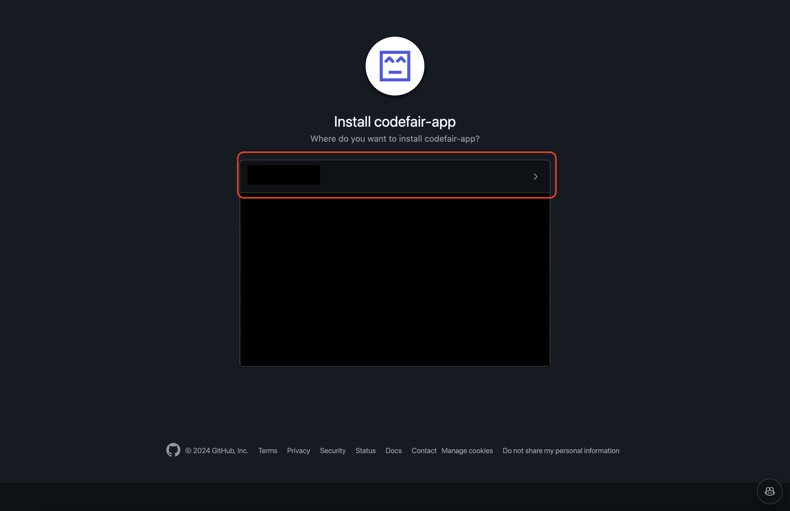

# Codefair

[Codefair](https://codefair.io/) is a free and open source GitHub app that acts as a personal assistant to your repositories. It helps make sure your project is [FAIR4RS](https://doi.org/10.1038/s41597-022-01710-x) compilant.  

## Getting Started

You may install Codefair either from the [GitHub Marketplace](https://github.com/marketplace/codefair-app) or the [Codefair app page](https://github.com/apps/codefair-app) on your personal GitHub account or GitHub organizations you belong to. The latter method helps circumvent the presence of a credit card in account or organizations.  

You may allow Codefair to access all your repositories and some selected repositories.  

Once the installation is completed, you will see a GitHub issued created on your selected repositories.  

## Adding License

To make your research software project FAIR compliant, add a license to your project repository on GitHub. Click on the "Add file" dropdown menu and select "Create new file". In the file name field, type in "LICENSE". Then on the left side of the page, you will see the option to "Choose a license template". You will then be presented with a list of common open source licenses.  

After select the one that best fits your project needs, click "Review and submit", then commit the changes directly to your main branch to add the license to your repository.  

## Adding Metadata/`CITATION.cff`

`CITATION.cff` files contain citation information and metadata for the software. They are readable by both human and machine. Adding a `CITATION.cff` file to your software repository allows your research software project to be more FAIR compliant in terms of findability and accessibility. Since it is supported by both GitHub and Zenodo during the indexing process.  

In the GitHub issue created by Codefair, click the "Add Metadata" badge. You will be redirected to the Codefair's metadata editing webpage.  

Once you have finished editing the metadata, press "Save and push to repository". Codefair will create a pull request with the updated metadata change to your GitHub repository, simply merge the change to the main branch of the repository.  

## Depositing to Zenodo

Now, to deposit your research software project on Zenodo, go back to the GitHub issue created by Codefair, click the "Create Release" badge. You will be redirected to the Codafair's release webpage.  

In the release webpage, you will need to connect your Zenodo account with Codefair.  

Once you've connected your Zenodo account with Codefair, either select an existing Zenodo deposition (i.e. using previously created project-specific DOIs) or ask Codefair to create a new Zenodo (i.e. creating a new project-specific DOI). Fill in the Zenodo metadata and GitHub information for the release. Next, click "Create draft GitHub release" and you will be redirected back to GitHub release page for final review.  

After you've published the release on GitHub, you will see in your Zenodo dashboard that a DOI is being created using the latest version of the release.  
