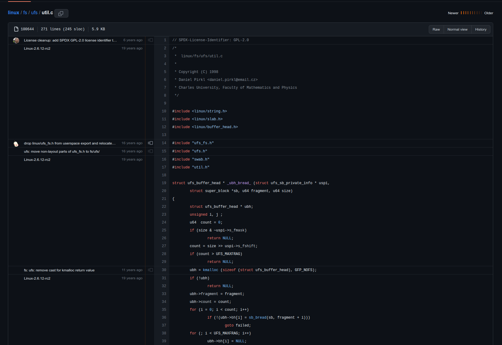

# Reproducible Computer Code

Having developed a Research Software Management Plan, it's time to delve into your project. In the upcoming sections, we will explore technical and coding strategies aimed at enhancing the reproducibility of your software.  

# General & Technical Practices

## Documentation in Source Code

Document every significant step (computer code) and the underlying logic executed in the process. It is not enough to  simply publish the code with the expectation that it is self-explanatory. The goal is to publish *well-documented*, *well-commented* code. Code commenting is the practice of adding short notes throughout your code. These notes are called comments. They explain how your program works, and your intentions behind it. This documention is necessary to prevent knowledge loss across different and future developers. This knowledge protection is essential as developers change within teams, and facility reuse by downstream users.  

Consider the following code snippet:  

```python
poly = PolynomialFeatures(degree=2, include_bias=False)
```

How will the variable `poly` behave if the number of `degrees` is set to 4 instead of 2, or `include_bias` is set to true? This information is the underlying logic executed to reach to the analysis result. One might be interested in the reasoning of the decision made during the analysis such as why choosing a specific value for the parameter of a function. Code commenting can help illustrate the intended logic side by side with the code step executed in the process. It also documents the intent, which is necessary to verify the code is accurately implementing the design. This documentation is especially important when considering that the code of the underlying function may change over time.  

Code commenting is often done manually and can be a time-consuming process. Many AI tools in the market help speeding up the code commenting process. These tools are integrated into version control systems (e.g. [GitHub Copilot](https://github.com/features/copilot)) and integrated development environments (e.g. Microsoft Visual Studio).  

While top-level comments should provide context and sketch the software logic in plain language, the source code itself should also ideally be self-contained explanation of logic and domain knowledge for people from different disciplines. Every name (function name, variable & constant name) is a change to communicate. For example, instead of naming your variables, `X`, `w` and `Z`, perhaps it is better to name them, `observation_X`, `elevation_angle_omega` and `reconstruction_Z`, or instead of calling a function `fetch()`, perhaps it is better to call the function what it does, `read_and_normalize_record()`.  

## Version Control Audit

One might be interested in seeing the details of the code for an analysis when a researcher is curious about how a specific process is designed to reach to a particular result. This interest may be due to validation of the analysis, suspicion of an error or to gain an understanding of new methodologies. Generating and providing an audit trail of work allows others follow or retrace the thought process in designing the code.  

  

This knowledge-sharing can be facilitated by publicly maintaining your source code with a version control system and including adequate and meaningful commit messages with each changes. Commit messages serve as a form of communication between team members working on a project and users outside of the project. Clear and descriptive messages provide valuable context about the changes made in a commit and why they were made, making it easier for others to understand and collaborate on the codebase. It allows team members to track the progress of specific features or bug fixes, review changes and provide feedback effectively.  

One way to effectively communicate through commit messages is to utilize [Conventional Commits](https://www.conventionalcommits.org/en/v1.0.0/). Conventional commit is a history log standard with a format like,  

```bash
<type>[optional scope]: <description>

[optional body]
    [optional footer(s)]
```

```bash
feat(github)!: Remove access to GitHub API

BREAKING CHANGE: Removes access from GitHub since we now only have access to GitLab.

Reviewed-by: XYZ
    Refs: ticket-123
```

The scope, `github`, in the example above is the part of the codebase affected by the change and the type, `feat`, is a required part of the commit message that indicates the nature of the change being made. Here is a list of common types in a conventional commit.  

- `fix` : bug fix
- `feat` : new feature
- `build` : change that affects the build system or external dependencies
- `chore` : change that does not fix a bug or add new feature
- `ci` : change to the continuous integration configuration files and scripts
- `docs` : change in documentation
- `style` : change that does not affect the meaning of the code (white-space, formatting, missing semi-colons, etc)
- `refactor` : code change that neither fixes a bug nor adds a feature
- `perf` : code change that improves performance
- `test` : new tests or correction of existing tests

There is a detail specification of [Conventional Commits v1.0.0](https://www.conventionalcommits.org/en/v1.0.0/), detailing all common types and some additional modifiers.  

## Interoperable Software Design

Interoperable software is designed to enabling integration with other software components via a standard programming interface. Consider the following two functions:  

```python
def foo():
    x = 1
    y = 2
    return x + y

def bar(x=1, y=2):
    return x + y
```

Which function can be reused and integrated with other software components easily, `foo()` or `bar()`? When other developers use the function in their software, `bar()` allows developers to utilize the underlying logic in the method without modifying its source code.  

```python
def baz(z=42):
    return bar(z, 916)
```

Aside from the software design perspective, employing middleware or integration platforms (e.g. Apache Kafka, an open source distributed event streaming platform) that provide standardized interfaces and tools for connecting disparate software systems help achieving software interoperability. These platforms act as intermediaries, enabling communication, data transformation, and message routing between different applications.  

## Use of Non-proprietary and Lossless Formats

In addition, the use of non-proprietary and lossless file formats for assets sharing is encouraged in reproducibility improvement.  

For documentation, formats like Markdown (`.md`) and plain text (`.txt`) are preferable over, as examples, Microsoft Word (`.docx`) and Apple iWork (`.pages`). For software data, formats like plain text comma-separated values (`.csv`), extensible markup language (`.xml`) and JavaScript object notation (`.json`) are preferable over, as examples, Microsoft Excel (`.xls`). For imagery assets, vector file formats like scalable vector graphics (`.svg`) and encapsulated postscript (`.eps`) are preferable over bitmap file formats like joint photographics expert group (`.jpg`) and graphics interchange format (`.gif`), since vector images are made up of paths defined by mathematical equations and can be scaled to any size without losing quality, unlike bitmap images, which become pixelated when resized. When compiling a software binary, where possible avoid using proprietary code compilers, that is building software for platforms, like Windows and MacOS. As platform and OS dependencies are potential barriers to other users or developers. Wherever possible, also include non-platform-specific binaries, or at least consider how a user may build the same software for different platforms.  

If files are stored using proprietary software, when that software is no longer available or not available other users, information within those files will be accessible and may be lost. If proprietary files are needed for sharing, consider providing open files in addition to these restrictive formats.  

## Dependency Preservation

Updates to libraries can lead to subtly different behaviours across versions. Hence, generating code dependency is the first objective in creating reproducible research. In most packages/libraries managers there exists a function to export packages/libraries installed for running the software you wrote. For example, in `pip`, a package installer for Python, you may run:  

```bash
pip freeze > requirements.txt
```

The resulting `requirements.txt` files would include the list of all packages you have installed for running the software with the same versions. Other researchers may follow this file and install the same packages/libraries used to run the software, by running:  

```bash
pip install -r requirements.txt
```

These dependency files help document these software requirements and help developers set up the same environment needed to develop and run the code.  

### Container Images

Some software can be built and shared as container images. Container images are self-contained, lightweight packages that encapsulate an application along with its dependencies and configuration settings. They are used in containerization technologies like Docker. Allowing users to easily retrieve and create containers and be able to run containers consistently across different computing environments.  

## Distribution and Preservation Repositories

A source code repository management service provides a centralized location for storing, managing and versioning source code files and related assets. These services offer tools and features to facilitate collaboration, code sharing, version control, and project management for software development teams. Also consider generating persistent identifiers (e.g. DOI or SWHID) for snapshots in the repository using tools like [Zenodo](https://zenodo.org/), for detailed instructions on generating persistent identifiers, please visit our learning module on [Research Software and Research Impact](https://mcmasterrs.github.io/lm_rs-impact/).  

You may also add and host your software to a software package registry. A software package registry is a centralized repository, cloud service or database that hosts and manages software packages. It serves as a platform for developers and users to discover, download, install, and manage software libraries, frameworks, tools or applications. Software package registries provide a standardized way to distribute and share software components across different programming languages and platforms. The package installer for Python mentioned above, `pip`, download packages from a software package registry called [PyPI (Python Package Index)](https://pypi.org/).  

There also exist container image repositories, which are centralized locations or cloud services that store and manage container images. These repositories are useful for distributing container images, but are not currently intended as a preservation system. Docker offers a service called [Docker Hub](https://hub.docker.com/), which is an open source registry to [store](https://docs.docker.com/engine/reference/commandline/push/) container images and allows others to download and run your container images.  

You may also consider adding your software to the [Research Software Directory](https://research-software-directory.org/). The Netherlands eScience Center developed the open source research software directory to promote visibility, findability, impact and reuse of research software. The [Digital Research Alliance of Canada](https://alliancecan.ca/en/services/research-software/canadian-research-software-platforms) assists Canadian researchers to add their active research software, which meet the following requirements, to the Research Software Directory.  

> 1. Is a Canadian Research Software (i.e., owned/led by a Canadian institution).
> 2. Is a platform/science gateway, or a component of software that can be deployed independently.
> 3. Is available via an open source license, or emerged from a publicly funded open source project.
> 4. Is currently maintained.
> 5. It fits with the promotional mandate of the Alliance.

Why might you need all these preservation methods, and when should you which? Each of these different repositories help promote different aspects of FAIR accessibility and reproducibility. Here are some general guidelines:  

- **GitHub or other source code repository management services**, for storing actively developed software source code files and related assets for collaboration and current access.
- **Zenodo or other records repository**, for generating a persistent object identifier for your software and using it for long term stable storage and citations (via DOI persistent identifiers) in publications.
- **Research Software Directory**, for making your research software discoverable and findable in the research software community.  
- **Software package registries and container image registries**, not necessarily best for preserving but good for hosting and distributing pre-built software packages/container images to a greater software development community.

## Software Testing

Research software often relies on external libraries, frameworks or tools. Testing aids in managing dependencies by verifying that the software works correctly with specific versions of those dependencies. This information is crucial for reproducibility because it allows others to recreate the software environment accurately, ensuring that the same results can be obtained.  

Testing enables collaboration among researchers by providing a shared understanding of the software's behaviour. By testing and documenting the software thoroughly, researchers can verify each other's work, reproduce experiments and validate research outcomes. This collaborative approach fosters transparency, trust and confidence in the research and open source community.  

Testing should be carried out in different levels of research software. Consider implementing a formal test plan, including unit, regression and integration testing, with the help of a continuous integration workflow (e.g. [GitHub Actions](https://github.com/features/actions), [Travis CI](https://www.travis-ci.com/)). Like the software source code, the test plan should be well-documented, well-commented and open source to increase the legitimacy and transparency of the projects. Clearly documenting these plans also helps ensure consistent use and updates by your own development team.  
