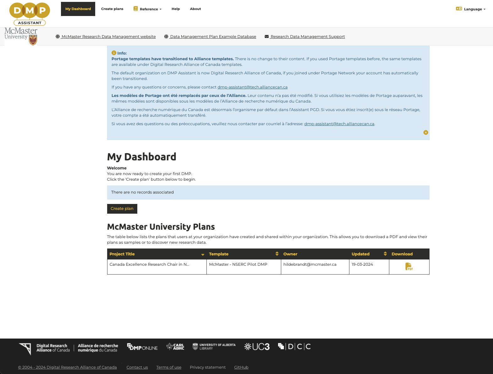
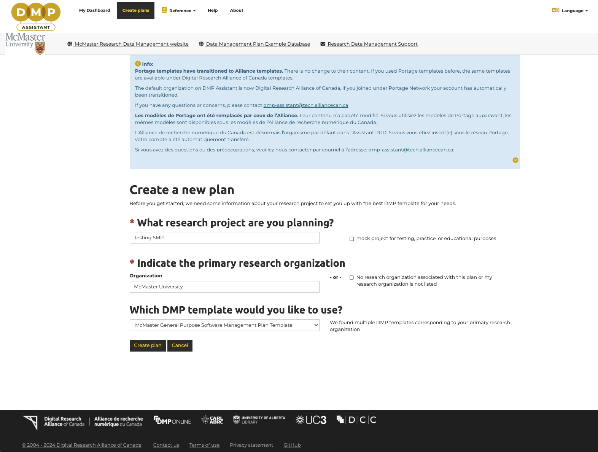
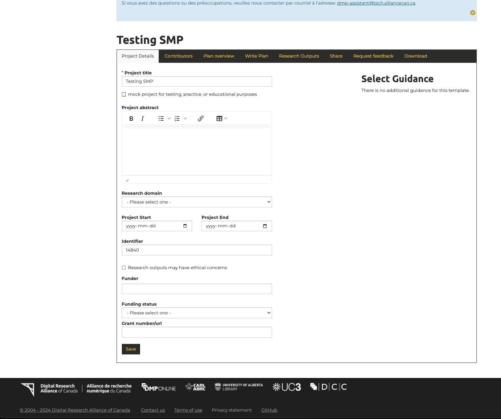
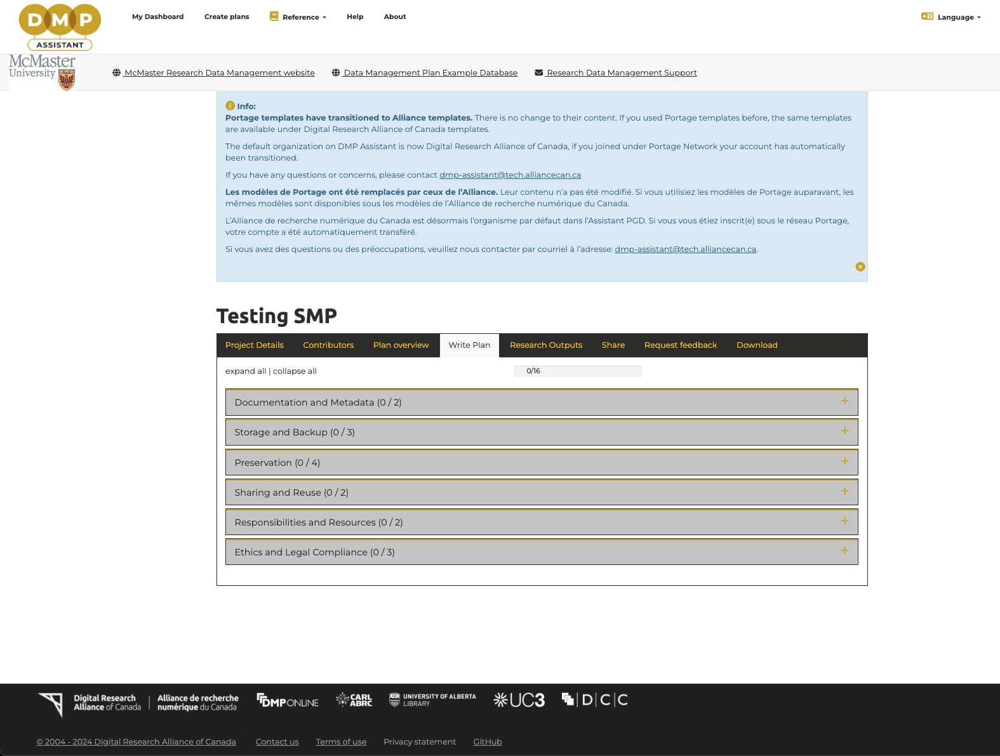
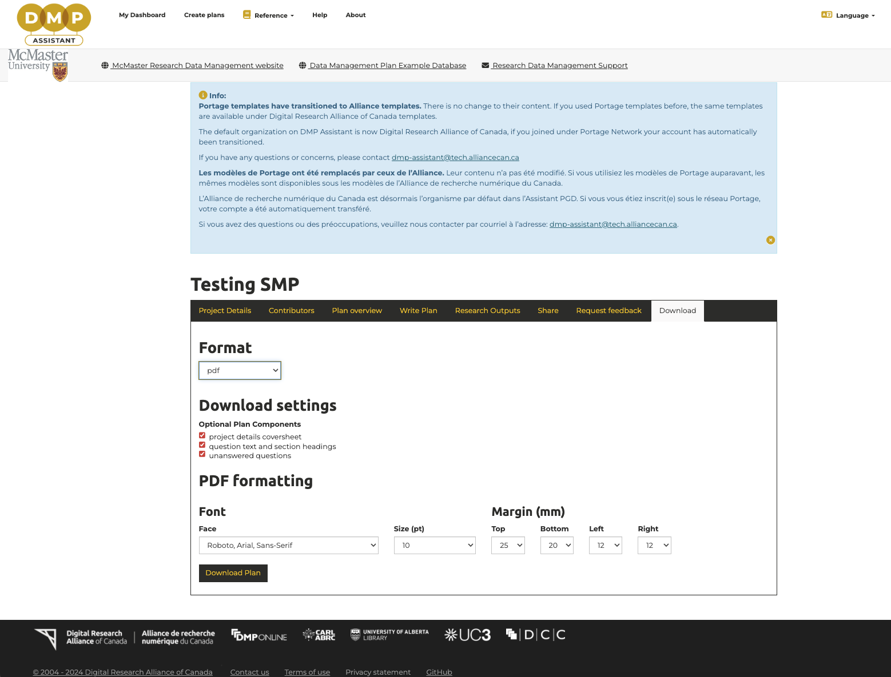

# McMaster General Purpose Software Management Plan Template

McMaster Research Software Development Team developed a general purpose software management plan template. The SMP is available on the [DMP Assistant](https://dmp-pgd.ca/), which is a nation, online, bilingual tool designed to help researchers in Canada to create Data Management Plans. Developed by the Digital Research Alliance of Canada in collaboration with the University of Alberta, it guides researchers through key questions about research data management and offering best-practice guidance.  

To create an SMP with the general purpose software management plan template, first sign in to the DMP Assistant with your McMaster University email. Then, under "My Dashboard", click the "Create plan" button begin.  

Next, you fill out the nature of the research software project you are planning and select "McMaster University" as the primary research organization. Once you've selected the primary research organization, choose the "McMaster General Purpose Software Management Plan Template" and click "Create plan".  

You should now see your project details and you may provide additional information for your project. Click "Write Plan" on the tab and fill out all the sections for the SMP with explanatory guidance text.  

    
    

 

Once you've finished, you may go to the "Download" tab and export your completed SMP in formats like `.pdf`, `.csv`, `.html`, `.txt`, `.docx` and `.json`.  

